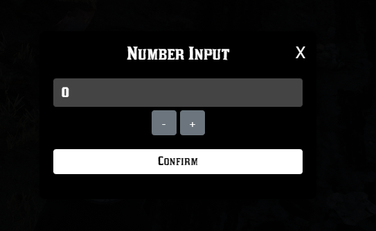
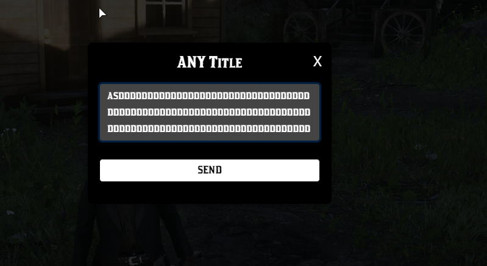
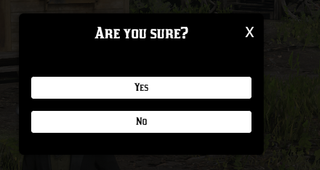

# cdo_inputs

- These modals are fully created with HTML and CSS, without using images.
- This is a simple script that provides a set of input functions.
- These modals have a 0.0 ms performance impact and are very easy to use.
- The modals are responsive and can be used on any resolution.
- These modals can resize the text to fit the input box.
- They have backward compatibility with the old `vorp_inputs` calls.

## Installation

- remove the old `vorp_inputs` package and copy the `cdo_inputs` folder to your project:
- ensure cdo_inputs in your server cfg.
- enjoy! :)

## Commands
- /testnumberinput

- /testinput

- /testconfirm

